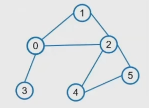

使用torch-geometric包的时候会报错no module named torch_sparse / torch_scatter

要去https://pytorch-geometric.com/whl/torch-1.11.0+cpu.html(这里注意torch版本和python版本)下载对应的.whl文件(下载时也注意选择对应python版本的)，本项目中已经放在environment文件夹下了

然后在venv的终端运行：pip install C:\Users\lenovo\Desktop\torch_scatter-2.0.9-cp310-cp310-win_amd64.whl，安装成功就不报错了

安装PyG最好参考github官方文档，https://github.com/pyg-team/pytorch_geometric/blob/master/README.md#installation, 直接安装编译好的.whl文件即可(找pip wheels)

测试用图：

edge_index = torch.tensor([[0, 0, 0, 1, 1, 2, 2, 2, 2, 3, 4, 4, 5, 5], [1, 2, 3, 0, 2, 1, 0, 4, 5, 0, 2, 5, 2, 4]])

x = torch.tensor([[0.0, 1.0, 2.0], [1.0, 0.0, 3.0], [2.0, 3.0, 0.0], [3.0, 4.0, 5.0], [4.0, 5.0, 6.0], [7.0, 8.0, 9.0]], dtype=torch.float)

num_nodes = 6